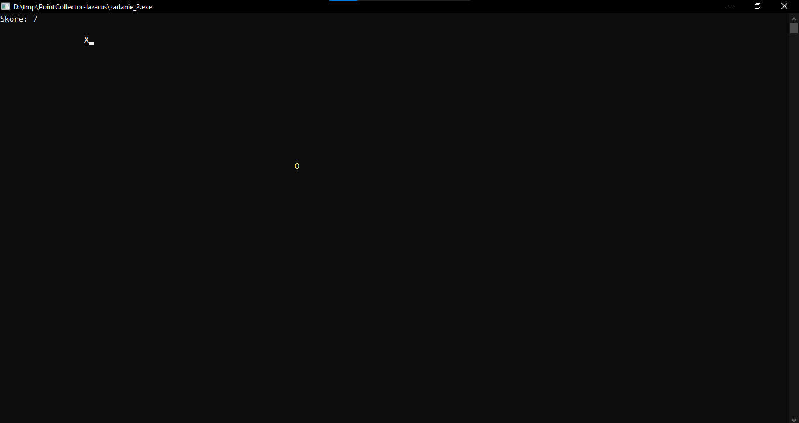

# Game: Catch the "O"

## Overview

This is a simple console-based game implemented in Pascal. The player controls a character "X" with the goal of collecting points represented by the letter "O" that appears randomly on the screen. The game ends if the player accumulates 10 points, collides with the screen borders, or manually exits.

## Instructions

1. Run the program in a Pascal-compatible IDE or compiler.

2. Use the following keys to control the movement of the character "X":

    - `W`: Move up
    - `A`: Move left
    - `S`: Move down
    - `D`: Move right

3. Collect the letter "O" to score points.

4. The game ends under the following conditions:

    - You accumulate 10 points (You Win).
    - Your character "X" collides with the screen borders (Game Over).

5. After the game ends, the result is displayed, indicating whether you won or lost.

## Screenshots

Include screenshots of the game in action, capturing different stages such as initial state, gameplay, and game over.

## Technical Details

-   **Language Used:** Pascal
-   **Dependencies:** CRT unit for console-based I/O
-   **Randomization:** The game utilizes the `random` function to generate random positions for the letter "O."

Feel free to modify the game or provide feedback for improvements!
